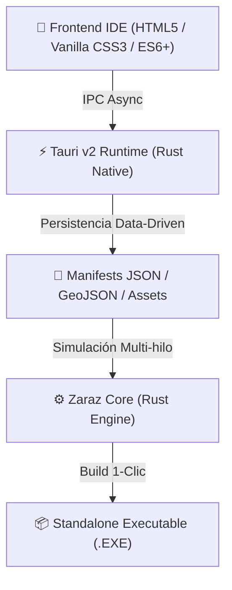

<div align="center">
  <h1>⚙️ Zaraz Studio 2.0 (Zaraz Maker)</h1>
  <p><strong>El Motor No-Code y Suite de Desarrollo Visual de Última Generación para Juegos de Simulación, Estrategia y RPG</strong></p>

  <p>
    
    
    
    
    
  </p>
</div>

<br>

> ⚠️ **Nota de Portafolio:** Este repositorio sirve como **Landing Page / Showcase** de **Zaraz Studio 2.0 (Zaraz Maker)**. El motor de simulación subyacente (`zaraz-core`) y sus herramientas nativas están construidos bajo una arquitectura modular y agnóstica de alto rendimiento.

---

## 🌍 ¿Qué es Zaraz Studio?

**Zaraz Studio 2.0** (conocido también como *Zaraz Maker*) es un entorno de desarrollo de videojuegos (IDE) y motor de simulación **100% No-Code**, diseñado para democratizar la creación de juegos de simulación económica, estrategia en tiempo real, gestión de entidades y videojuegos RPG.

Con un enfoque centrado en la accesibilidad y la eliminación de la sobrecarga cognitiva, **Zaraz Studio** permite a diseñadores, creativos e ilustradores construir mundos complejos, economías de mercado, sistemas demográficos, árboles de habilidades y misiones narrativas **sin escribir una sola línea de código**. 

Su arquitectura es **100% Agnóstica**, permitiendo crear proyectos de cualquier temática o género: desde fantasía medieval, gestión deportiva y magnates de la industria, hasta simulación geopolítica sci-fi, aventuras investigativas o gestión musical.

---

## 🛠️ Stack Tecnológico & Arquitectura

**Zaraz Studio** está construido combinando el rendimiento nativo de bajo nivel de **Rust** con la flexibilidad de diseño de las tecnologías Web modernas.



### ⚙️ Backend Core (`zaraz-core`) — Rust 100%
- **Lenguaje Principal:** **Rust** (Garantía de Memory Safety, cero condiciones de carrera y concurrencia pura).
- **Indexación Espacial Masiva:** Algoritmos de **Quadtrees 2D** para detección de colisiones y selección en mapas vectoriales gigantescos.
- **Rutas & Pathfinding A*:** Algoritmos de caminos mínimos en grafos dinámicos (`zaraz-core::pathfinding`) integrados con costos de terreno y throttling de rendimiento.
- **Matemática Vectorial:** Cálculo de geometrías y proyecciones usando `glam`.
- **Inteligencia Artificial (Utility AI):** Evaluadores de utilidad (`AgentBrain`) basados en curvas de consideración (lineal, cuadrática, sigmoide) para decisiones autónomas de NPCs y entidades.
- **Motor de Tiempo Universal:** Sistema de reloj multiescala (`zaraz-core::time`) con escalas horarias, diarias e intervalos por Ticks.
- **Bus de Eventos Desacoplado:** Bus de comunicación Pub/Sub (`EventBus`) para desacoplar subsistemas de simulación en múltiples hilos.
- **Sistema de Partida Doble:** Contabilidad financiera (`Ledger`) con seguimiento de flujos de caja, saldos y control de deuda.
- **Sistema "Modo Patata" (`zaraz_core::performance`):** Control fino de rendimiento de simulación y gráficos (`Potato`, `Standard`, `Ultra`) con límites de FPS (30–144 FPS), VSync, MSAA y throttling dinámico de IA/Pathfinding para garantizar fluidez en cualquier hardware.

### 🖥️ Runtime & Frontend IDE
- **Desktop Runtime:** **Tauri v2**, ofreciendo una huella de memoria ultraliviana (menor a 50 MB de RAM en reposo) e integración IPC nativa a máxima velocidad.
- **Frontend No-Code:** Vanilla HTML5, JavaScript Moderno y Vanilla CSS3 estilizado (estética de alta fidelidad, Dark Mode elegante, Glassmorphism y micro-animaciones sin dependencias pesadas de frameworks).
- **Visual Scripting & Diagramas:** Cables **SVG Bezier Splines** dinámicos para conectar nodos en árboles tecnológicos y grafos narrativos.
- **Cartografía Vectorial:** Integración con **Leaflet** y renderizado de geometrías crudas **GeoJSON** para regiones, polígonos y grillas tácticas (cuadrícula y hexágonos).

---

## 🎨 Suite de Herramientas No-Code (Zaraz Studio 2.0)

El estudio ofrece dos vistas de trabajo adaptadas al perfil del creador:

### 🌱 1. Modo Principiante (Flujo 1-2-3 Guiado)
Diseñado para la máxima velocidad de prototipado sin sobrecarga mental:
1. 🗺️ **Paso 1: Dibuja tu Mundo & Mapa** (Importación de fondos PNG/JPG y trazado de regiones).
2. 👤 **Paso 2: Crea tus Personajes & Héroes** (Diseño de personajes con retratos visuales y atributos).
3. 📦 **Paso 3: Exporta tu Juego (.EXE)** (Compilación nativa en 1 solo clic).

---

### ⚙️ 2. Modo Avanzado (Carpetas Categoría Colapsables)

Suite completa de 12 inspectores especializados agrupados en 4 carpetas contenedoras limpias:

#### 🗺️ Category 1: Cartografía, Terreno & Demografía
* **Editor de Mapas Custom:** Carga mapas base PNG/JPG creados con IA o GIMP, traza vectores de provincia en `custom_map.geojson` y genera grillas tácticas (cuadrículas/hexágonos).
* **Pincel de Terreno & Biomas:** Pinta capas ambientales en `biomes.json`.
* **Gestor de Población (POPs):** Configura etnias, clases sociales (`PopGroup`), necesidades de consumo básico/lujo, baselines morales y pirámides de educación.

#### 🏭 Category 2: Economía, Producción & Tecnologías
* **Diseñador de Economía & Cadenas de Producción:** Define materias primas, manufacturas y recetas industriales (`economy_manifest.json`) con diagramas visuales del flujo `Insumo ➔ Edificio ➔ Producto`.
* **Editor de Árbol Tecnológico (Tech Tree Graph):** Lienzo interactivo de grafos con cables SVG Bezier punteados para encadenar tecnologías, prerequisitos y costos de ciencia.

#### ⚡ Category 3: Narrativa, Personajes & Reglas No-Code
* **Creador No-Code de Personajes & Héroes:** Diseña líderes, héroes y NPCs (`characters_manifest.json`) configurando atributos RPG (`💪 Fuerza`, `🧠 Inteligencia`, `🔮 Magia`, `❤️ Salud`, `🛡️ Carisma`), picker visual de retratos PNG y afiliación a facciones.
* **Diseñador No-Code de Reglas & Políticas:** Decreta reglamentos, aranceles y políticas (`laws_manifest.json`) con modificadores dinámicos en tiempo real sobre las variables del juego.
* **Editor de Eventos Narrativos (Node Graph):** Lienzo de nodos interactivos con cables SVG y **Catálogo Sidebar de Referencias del Proyecto** para vincular variables custom, reglas promulgadas y tecnologías.
* **Gestor de Assets & Galería Multimedia:** Importador de imágenes PNG/SVG (`assets_manifest.json`) y mapeo visual a entidades del motor.
* **Inspector de Variables & Atributos Custom:** Declarador no-code de variables (`Global`, `Personaje`, `POPs`, `Región`) con probador interactivo en vivo.
* **Diseñador No-Code de Misiones & Contratos:** Editor visual de misiones narrativas, acuerdos comerciales, pactos diplomáticos y contratos con cláusulas numéricas, plazos en ticks, recompensas/penalizaciones y **categorías dinámicas personalizadas creadas por el usuario** (`contracts_manifest.json`).

#### 📦 Category 4: Compilación & Publicación Standalone
* **Compilador & Exportador Standalone (.EXE):** Realiza una auditoría automática de integridad pre-flight (revisión de mapas, assets, economía y eventos) y empaqueta en 1 clic todos los datos JSON junto al binario ejecutable de distribución.

---

## 🚀 Cómo Ejecutar Zaraz Studio Localmente

Si deseas compilar y ejecutar el estudio en tu equipo:

### Requisitos Previos
- **Rust** ($1.75+$) instalado vía [rustup.rs](https://rustup.rs/).
- **Node.js** ($v18+$) y `npm`.
- **Tauri CLI v2** (`npm install -g @tauri-apps/cli`).

### Instrucciones
```bash
# 1. Clonar el repositorio
git clone https://github.com/yeib/ZarazMaker.git
cd ZarazMaker

# 2. Iniciar el entorno en modo desarrollo
npm run tauri dev
```

---

<div align="center">
  <p><i>Arquitectura No-Code diseñada con ❤️ en Rust, Tauri v2 y Vanilla Web Tech.</i></p>
  <p><b>Estado del Proyecto:</b> En Desarrollo Activo (Zaraz Studio 2.0 Ready).</p>
</div>
