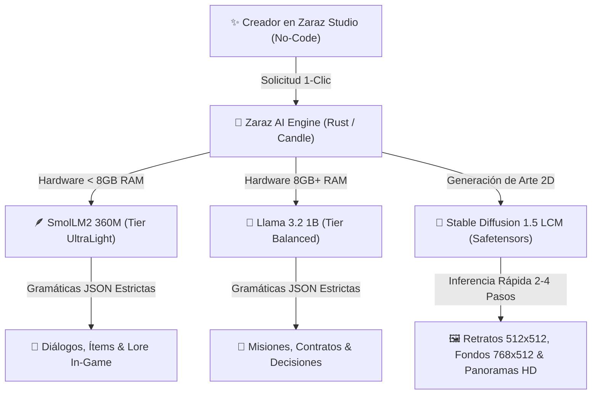
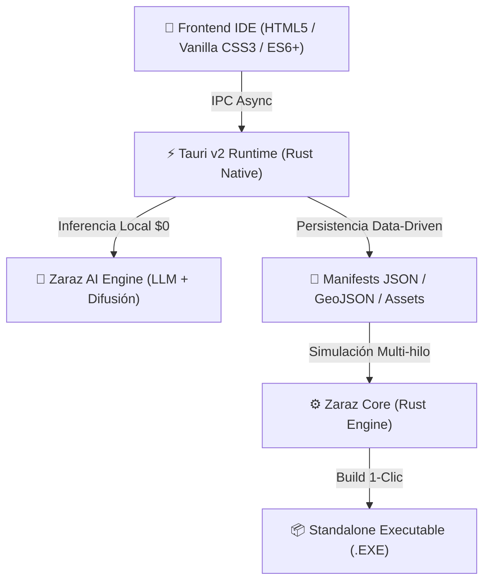

  
  <h1>⚙️ Zaraz Studio 2.0 (Zaraz Maker)</h1>
  
<strong>El Motor No-Code y Suite de Desarrollo Visual de Última Generación para Juegos de Simulación, Estrategia y RPG</strong>

  

    
    
    
    
    
    
  

 

---

## 🌍 ¿Qué es Zaraz Studio?

**Zaraz Studio 2.0** (conocido también como *Zaraz Maker*) es un entorno de desarrollo de videojuegos (IDE) y motor de simulación **100% No-Code**, diseñado para democratizar la creación de juegos de simulación económica, estrategia en tiempo real, gestión de entidades y videojuegos RPG.

Con un enfoque centrado en la accesibilidad y la eliminación de la sobrecarga cognitiva, **Zaraz Studio** permite a diseñadores, creativos e ilustradores construir mundos complejos, economías de mercado, sistemas demográficos, árboles de habilidades, misiones narrativas y arte visual **sin escribir una sola línea de código**. 

Su arquitectura es **100% Agnóstica**, permitiendo crear proyectos de cualquier temática o género: desde fantasía medieval, gestión deportiva y magnates de la industria, hasta simulación geopolítica sci-fi, aventuras investigativas o gestión musical.

---

## 🧠 Suite de Inteligencia Artificial 100% Offline (Local & Costo Cero)

Zaraz Studio integra de forma nativa un subsistema de **IA Generativa Local** (`zaraz-ai`), diseñado para asistir a los creadores en la generación de texto estructurado, diálogos de NPCs, misiones y assets visuales **sin requerir conexión a Internet, sin suscripciones mensuales y sin enviar datos a servidores externos ($0 API Cost)**.

La inferencia se ejecuta puramente en el hardware del usuario mediante **Rust** (`candle` / `candle-transformers`), garantizando rendimiento en tiempo real y compatibilidad multiplataforma sin requerir herramientas externas de compilación C++.

### 🤖 Modelos de IA Gratuitos Integrados

Zaraz Studio cuenta con **3 modelos de IA offline optimizados** según el hardware y la tarea:

| Modelo | Tipo / Motor | Tier de Hardware | Uso Principal en Zaraz Studio | Licencia |
| :--- | :--- | :--- | :--- | :--- |
| **🪶 SmolLM2 360M Instruct** *(Hugging Face)* | LLM de Texto (GGUF Cuantizado) | **UltraLight** (< 8 GB RAM) | Generación instantánea de árboles de diálogo de NPCs, nombres de localidades, descripciones breves de ítems y lore ligero en laptops o PCs modestas sin GPU dedicada. | Apache-2.0 *(100% Libre)* |
| **🦙 Llama 3.2 1B Instruct** *(Meta)* | LLM de Texto (GGUF Cuantizado) | **Balanced** (8 GB+ RAM) | Generación narrativa profunda, misiones complejas con condiciones lógicas (`Quest Inspector`), trasfondos de héroes/personajes (`RPG Inspector`) y toma de decisiones contextuales con hasta 4096 tokens de contexto. | Llama 3.2 Community *(Abierta/Gratuita)* |
| **🎨 Stable Diffusion 1.5 LCM** *(Stability AI / LCM)* | Difusión Visual 2D (Safetensors + Candle) | **CPU / GPU** (2 a 4 pasos) | Fábrica de arte local: síntesis de retratos de personajes (512x512 px), fondos para eventos tácticos (768x512 px) e ilustraciones de ciudades / wallpapers panorámicos (1024x512 px) que se guardan directamente en el proyecto. | CreativeML Open RAIL-M *(Gratuita)* |

#### 🛡️ Garantía de Salida Estructurada (Zero JSON Breaks)
Los modelos de texto operan bajo un motor de **Gramáticas y Logit Processors** (`zaraz-ai::grammar`). Esto asegura matemáticamente que la IA nunca "rompa" el formato JSON ni alucine estructuras incompatibles, inyectando directamente los datos en los manifiestos (`characters_manifest.json`, `dialogues_manifest.json`, etc.).

---

## 🛠️ Stack Tecnológico & Arquitectura

**Zaraz Studio** está construido combinando el rendimiento nativo de bajo nivel de **Rust** con la flexibilidad de diseño de las tecnologías Web modernas.

### ⚙️ Backend Core (`zaraz-core`) — Rust 100%
- **Lenguaje Principal:** **Rust** (Garantía de Memory Safety, cero condiciones de carrera y concurrencia pura).
- **Indexación Espacial Masiva:** Algoritmos de **Quadtrees 2D** para detección de colisiones y selección en mapas vectoriales gigantescos.
- **Rutas & Pathfinding A\*:** Algoritmos de caminos mínimos en grafos dinámicos (`zaraz-core::pathfinding`) integrados con costos de terreno y throttling de rendimiento.
- **Matemática Vectorial:** Cálculo de geometrías y proyecciones usando `glam`.
- **Inteligencia Artificial (Utility AI):** Evaluadores de utilidad (`AgentBrain`) basados en curvas de consideración (lineal, cuadrática, sigmoide) para decisiones autónomas de NPCs y entidades en juego.
- **Motor de Tiempo Universal:** Sistema de reloj multiescala (`zaraz-core::time`) con escalas horarias, diarias e intervalos por Ticks.
- **Bus de Eventos Desacoplado:** Bus de comunicación Pub/Sub (`EventBus`) para desacoplar subsistemas de simulación en múltiples hilos.
- **Sistema de Partida Doble:** Contabilidad financiera (`Ledger`) con seguimiento de flujos de caja, saldos y control de deuda.
- **Sistema "Modo Patata" (`zaraz_core::performance`):** Control fino de rendimiento de simulación y gráficos (`Potato`, `Standard`, `Ultra`) con límites de FPS (30–144 FPS), VSync, MSAA y throttling dinámico de IA/Pathfinding para garantizar fluidez en cualquier hardware.

### 🖥️ Runtime & Frontend IDE
- **Desktop Runtime:** **Tauri v2**, ofreciendo una huella de memoria ultraliviana (menor a 50 MB de RAM en reposo) e integración IPC nativa a máxima velocidad.
- **Frontend No-Code:** Vanilla HTML5, JavaScript Moderno modular y Vanilla CSS3 estilizado (Dark Mode de alta fidelidad, Glassmorphism y micro-animaciones sin dependencias pesadas de frameworks).
- **Visual Scripting & Diagramas:** Cables **SVG Bezier Splines** dinámicos para conectar nodos en árboles tecnológicos y grafos narrativos.
- **Cartografía Vectorial:** Integración con **Leaflet** y renderizado de geometrías crudas **GeoJSON** para regiones, polígonos y grillas tácticas (cuadrícula y hexágonos).

---

## 🎨 Suite de Herramientas No-Code (Zaraz Studio 2.0)

El estudio ofrece dos vistas de trabajo adaptadas al perfil del creador:

### 🌱 1. Modo Principiante (Flujo 1-2-3 Guiado)
Diseñado para la máxima velocidad de prototipado sin sobrecarga mental:
1. 🗺️ **Paso 1: Dibuja tu Mundo & Mapa** (Importación de fondos PNG/JPG y trazado de regiones).
2. 👤 **Paso 2: Crea tus Personajes & Héroes** (Diseño de personajes con retratos visuales y atributos).
3. 📦 **Paso 3: Exporta tu Juego (.EXE)** (Compilación nativa en 1 solo clic).

---

### ⚙️ 2. Modo Avanzado (Inspectores Especializados)

Suite completa de inspectores especializados organizados en categorías modulares:

#### 🗺️ Cartografía, Terreno & Demografía
* **Editor de Mapas Custom:** Carga mapas base PNG/JPG creados con IA o GIMP, traza vectores de provincia en `custom_map.geojson` y genera grillas tácticas (cuadrículas/hexágonos).
* **Pincel de Terreno & Biomas:** Pinta capas ambientales en `biomes.json` y modela heightmaps.
* **Gestor de Población (POPs):** Configura etnias, clases sociales (`PopGroup`), necesidades de consumo básico/lujo, baselines morales y pirámides de educación.

#### 🏭 Economía, Producción & Tecnologías
* **Diseñador de Economía & Cadenas de Producción:** Define materias primas, manufacturas y recetas industriales (`economy_manifest.json`) con diagramas visuales del flujo `Insumo ➔ Edificio ➔ Producto`.
* **Editor de Árbol Tecnológico (Tech Tree Graph):** Lienzo interactivo de grafos con cables SVG Bezier punteados y navegación fluida por canvas para encadenar tecnologías, prerequisitos y costos de ciencia.

#### ⚡ Narrativa, Personajes & Asistente IA No-Code
* **Creador No-Code de Personajes & Héroes:** Diseña líderes, héroes y NPCs (`characters_manifest.json`) con atributos RPG (`💪 Fuerza`, `🧠 Inteligencia`, `🔮 Magia`, `❤️ Salud`, `🛡️ Carisma`), afiliación a facciones y botón `🪄 Auto-Lore` por IA local.
* **Diseñador No-Code de Reglas & Políticas:** Decreta reglamentos, aranceles y políticas (`laws_manifest.json`) con modificadores dinámicos en tiempo real sobre las variables del juego.
* **Editor de Eventos & Diálogos Narrativos (Node Graph):** Lienzo de nodos interactivos con cables SVG y generador `🪄 Auto-Diálogo` asistido por IA para estructurar árboles conversacionales con emociones y triggers.
* **Gestor de Assets & Fábrica Visual 2D:** Importador de imágenes PNG/SVG (`assets_manifest.json`) integrado con el generador local `🎨 Retratos SD 1.5` y `🌄 Fondos / Escenarios HD` sin salir del editor.
* **Inspector de Variables & Atributos Custom:** Declarador no-code de variables (`Global`, `Personaje`, `POPs`, `Región`) con probador interactivo en vivo.
* **Diseñador No-Code de Misiones & Contratos:** Editor visual de misiones narrativas, acuerdos comerciales, pactos diplomáticos y contratos con cláusulas numéricas, plazos en ticks y botón `🪄 Generar Misión` asistido por IA (`contracts_manifest.json`).

#### 📦 Compilación & Publicación Standalone
* **Compilador & Exportador Standalone (.EXE):** Realiza una auditoría automática de integridad pre-flight (revisión de mapas, assets, economía y eventos) y empaqueta en 1 solo clic todos los datos JSON junto al binario ejecutable de distribución.

---

  
<i>Arquitectura No-Code diseñada con ❤️ en Rust, Tauri v2 y Vanilla Web Tech.</i>

  
<b>Estado del Proyecto:</b> En Desarrollo Activo (Zaraz Studio 2.0 Ready · IA Local Integrada).

